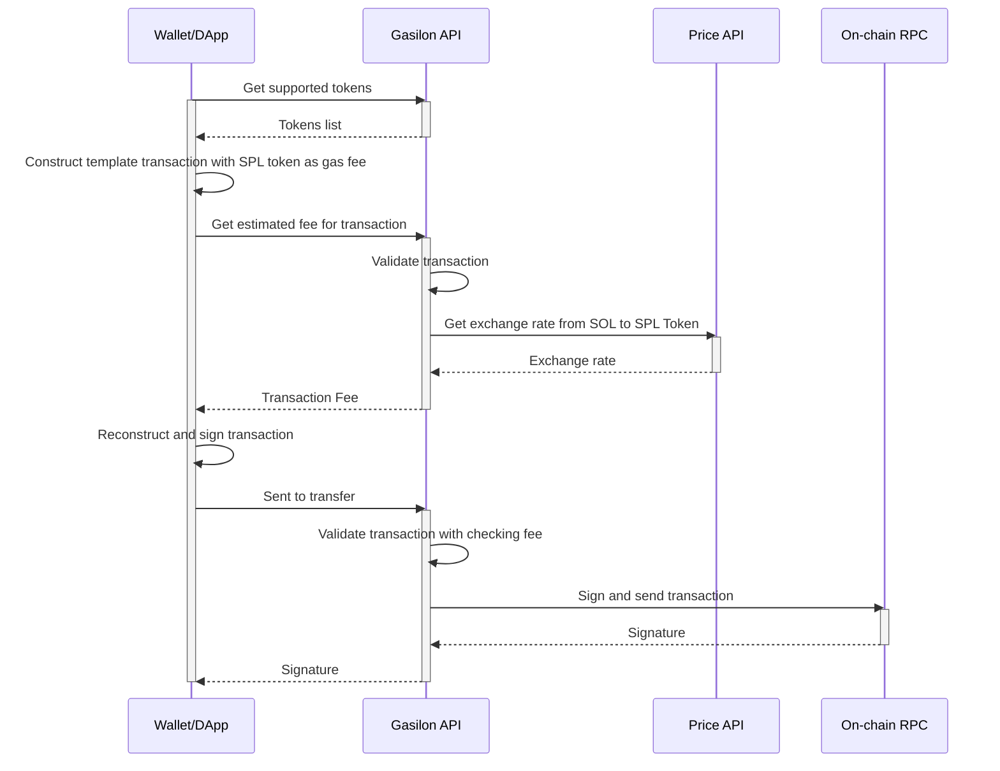

# Gasilon

## What is Gasilon?

Gasilon is a gasless solution currently supports on Solana. It helps user make a transaction without SOL, using SPL Token to pay fee instead.

Gasilon provides an API [`api.gasilon.com`](https://api.gasilon.com) for anyone (Wallet, DApp,...) to easily integrate gasless features, making any transaction without SOL seamlessly. The source code also includes `Client CLI` as a code snippet for testing, see how it works and for playground quickly.

## How it works?

Gasilon uses a technique called `relayer`, we have some references from [`Solana-labs/Octane`](https://github.com/solana-labs/octane) project.

Here is about `Gasilon` flow:



## Setup
First, install packages
```
yarn install
```

### Playground with Client CLI
Create `.env` file at `client/`
```
PRIVATE_KEY=<client private key to make transaction>
GASILON_ENDPOINT=https://api.gasilon.com
```
Run commands:
```
cd client && yarn get-fee
# or
cd client && yarn transfer
```

### Config API
Create `.env` file at project scope
```
ENVIRONMENT=<production || development>
SOLANA_SECRET_KEY=<private key>

# Use price API
REDIS_USERNAME
REDIS_PASSWORD
REDIS_HOST
```
1. make sure `.env` file configured as described above
2. run `yarn setup` to check associated accounts (for fee tokens in the config list in `config.json`)

#### Local run Gasilon
```
cd server && yarn dev
```

#### To deploy
Deploy to production (AWS only for now, welcome PR for another platforms)
Run `yarn deploy` to deploy this to your AWS account (see `sst.config.ts` for further details)


